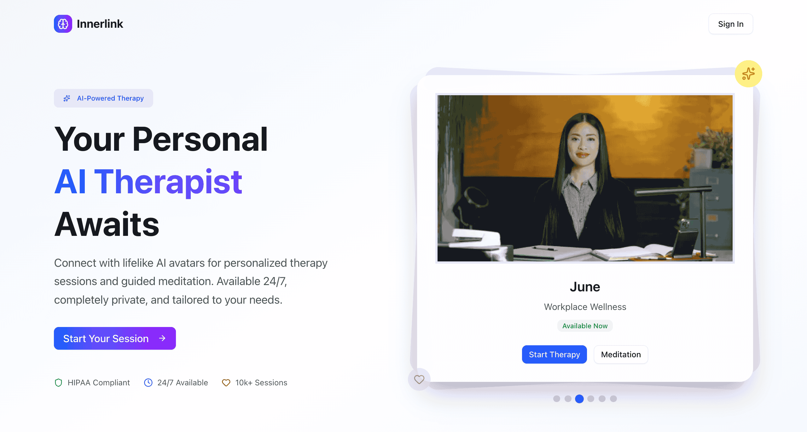

# InnerLink



_AI-Powered Therapy and Meditation_

InnerLink is an AI-powered therapy and meditation app that provides a supportive, lifelike avatar to guide you on your journey to mental wellness. Experience personalized care and real-time support, whenever you need it.

🌐 **Live Demo:** [https://innerlink.up.railway.app](https://innerlink.up.railway.app)

## ✨ Features

- 🤖 **AI-Powered Therapy** - Intelligent conversations with lifelike avatars
- 🧘 **Guided Meditation** - Personalized meditation sessions
- 👤 **User Profiles** - Complete your wellness profile for personalized experiences
- 💬 **Real-time Chat** - Interactive sessions with AI therapists
- 🔐 **Secure Authentication** - Safe and private user accounts
- 📱 **Responsive Design** - Works seamlessly on all devices
- 🎨 **Modern UI** - Beautiful interface built with Tailwind CSS and Radix UI
- ✨ **TypeScript** - Fully typed for better development experience

## Quick Start

1. **Clone and install dependencies**

   ```bash
   npm install
   ```

2. **Set up environment variables**

   ```bash
   cp env.example .env.local
   ```

   Fill in your database and API keys.

3. **Set up database**

   ```bash
   npm run db:generate
   npm run db:migrate
   ```

4. **Run development server**
   ```bash
   npm run dev
   ```

Visit [http://localhost:3000](http://localhost:3000) to see your app.

## 🧘 App Features

### Therapy Sessions

- Interactive AI-powered therapy sessions
- Multiple avatar personalities to choose from
- Personalized conversation flows
- Session history and progress tracking

### Meditation

- Guided meditation sessions
- Customizable meditation lengths
- Different meditation styles and techniques
- Progress tracking and achievements

### User Experience

- Complete profile setup for personalized experience
- Secure authentication and data privacy
- Responsive design for all devices
- Real-time avatar interactions

## 📱 Screenshots

_Add your app screenshots here when available_

## 🤝 Contributing

We welcome contributions! Please feel free to submit a Pull Request.

## 📄 License

This project is licensed under the MIT License.

## 👨‍💻 Developer

Created by [@vivekvt\_](https://twitter.com/vivekvt_)

---

_InnerLink - Your AI companion for mental wellness_ 🌟

## Scripts

- `npm run dev` - Start development server
- `npm run build` - Build for production
- `npm run start` - Start production server
- `npm run db:generate` - Generate database migrations
- `npm run db:migrate` - Apply database migrations
- `npm run db:studio` - Open Drizzle Studio

## 🛠️ Tech Stack

- **Framework:** Next.js 15 (App Router)
- **Authentication:** Better Auth
- **Database:** PostgreSQL + Drizzle ORM
- **AI Integration:** Custom AI avatar integration
- **Styling:** Tailwind CSS + Shadcn/ui components
- **TypeScript:** Full type safety
- **Deployment:** Railway
- **Real-time Communication:** WebSocket-based chat

## 🚀 Getting Started

### Prerequisites

- Node.js 18+
- PostgreSQL database
- Environment variables (see `.env.example`)

### Installation
